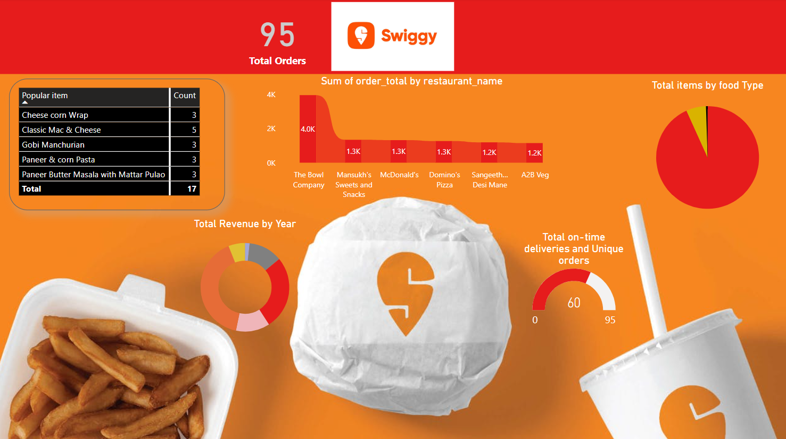

# PowerBI Simple Dashboard for Sweegy Food Delivery Data

# Repository Overview
This repository contains a PowerBI dashboard designed to provide insightful visualizations and analytics for Sweegy's food delivery data. The dashboard includes various charts and tables to help understand different aspects of the food delivery business, such as item distribution, delivery performance, order patterns, revenue trends, and popular items.

# Key Components of the Dashboard
Pie Chart (Total Items)

# Description: 
Displays the distribution of total items delivered.

# Purpose:
Helps in understanding the variety and proportion of items being delivered.
Gauge Chart (On-time and Unique Delivery)

# Description: 
Measures the performance of deliveries, focusing on on-time deliveries and unique deliveries.

# Purpose:
Provides a quick view of delivery efficiency and customer satisfaction.
Ribbon Chart (Sum of Orders by Restaurant Name)

# Description: 
Shows the sum of orders categorized by different restaurant names.

# Purpose:
Highlights the performance and popularity of different restaurants over time.
Donut Chart (Revenue by Year)

# Description: 
Illustrates the revenue generated, segmented by year.

# Purpose:
Helps in analyzing revenue growth and identifying yearly trends.
Table (Popular Items)

# Description:
Lists the most popular items ordered by customers.

# Purpose:
Provides insights into customer preferences and top-selling items.

# Usage
# Data Analysis:
Enables in-depth analysis of food delivery data, helping in making informed business decisions.
# Performance Tracking: 
Assists in tracking key performance indicators (KPIs) such as on-time delivery rates and revenue trends.
# Business Insights: 
Provides actionable insights into customer preferences and restaurant performance.

# Getting Started
# To get started with this repository:
Clone the repository to your local machine.
Open the PowerBI dashboard file.
Connect your Sweegy food delivery data source to the dashboard.
Explore the various visualizations and tables to gain insights.
# Contribution
Contributions to improve the dashboard are welcome. Please follow the standard GitHub workflow for submitting issues and pull requests.
This PowerBI dashboard is a valuable tool for any business looking to leverage data for strategic planning and operational efficiency in the food delivery industry.
